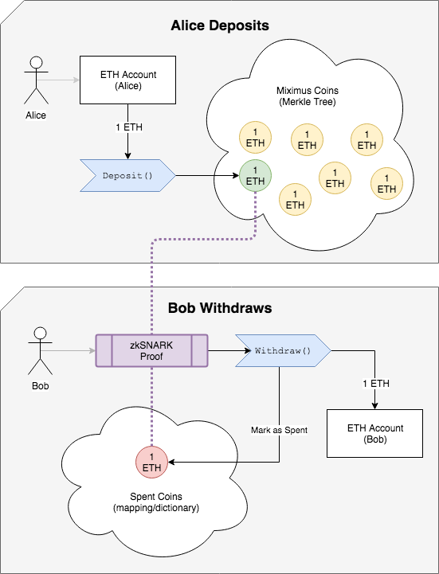

# Miximus

[](https://travis-ci.org/HarryR/ethsnarks-miximus)

Miximus is a self-service coin mixer and anonymous transfer method for Ethereum, it accepts deposits of 1 ETH, then allows you to withdraw coins by providing a zkSNARK proof that proves you know the spend key for one unspent coin without revealing which one it is.

For more information, see:

 * [Miximus.sol](solidity/contracts/Miximus.sol)
 * [miximus.py](python/miximus.py)
 * [test_miximus.py](python/test/test_miximus.py)
 * [miximus.cpp](circuit/miximus.cpp)

The zkSNARK prover is built as a native library which can plug-in to your application, when provided with the correct arguments it returns the zkSNARK proof as JSON. While you may think of zkSNARKs as being slow - the algorithms chosen for Miximus mean proofs can be made in 5 seconds, however we're still studying their security properties.

## Building

The following dependencies (for Linux) are needed:

 * cmake 3
 * g++ or clang++
 * gmp
 * libcrypto
 * boost
 * npm / nvm

### For OSX

Requires Brew and nvm.

```
make git-submodules # Pull sub-repositories
make -C ethsnarks mac-dependencies
make -C ethsnarks python-dependencies
nvm install --lts
make
```

### For Ubuntu:

```
make git-submodules # Pull sub-repositories
sudo make -C ethsnarks ubuntu-dependencies
make -C ethsnarks python-dependencies
nvm install --lts
make
```

### For CentOS / Amazon:

```
yum install cmake3 boost-devel gmp-devel
nvm install --lts
make git-submodules # Pull sub-repositories
make -C ethsnarks python-dependencies
make CMAKE=cmake3
```

## How It Works



Alice wants to transmit 1 coin to Bob

  1. Bob gives Alice the hash of a secret that only he knows
  2. Alice sends 1 ETH to the 'Deposit()' method of the Miximus smart contract, with that hash
  3. The 'Coin' gets inserted into a merkle tree of coins, all coins are 1 ETH
  4. Bob makes a zkSNARK proof, using the secret, that proves he owns that coin
      The proof includes an unlinkable 'spent tag', which prevents the same coin being spent twice
  5. Bob sends the Proof and the 'spent tag' to the Withdraw() method of the Miximus smart contract
  6. If the coin hasn't been spent, the contract deposits 1 ETH to Bob

### Technical Details

For Alice to send a coin to Bob she needs the hashed secret from Bob. Bob makes the random secret (a random field element, modulo the zkSNARK prime being used):

    coin_secret = FQ.random()

Bob passes the hash of that secret to Alice:

    bobs_leaf = H(coin_secret)  # Generated using `MakeLeafHash()` method of the smart-contract

Alice sends `bobs_leaf` with the Deposit, this is the leaf of the Merkle tree of coins. Bob can see when Alice has made his deposit by monitoring the `OnDeposit` event of the smart contract. Only Bob knows the secret, so only Bob can make a successful zkSNARK proof.

Bob fetches the Merkle tree path from the smart contract (without doing an on-chain transaction, as that would reveal his coin) using the `leaf_index` parameter in the `OnDeposit` event and the `GetPath()` method of the smart-contract, along with the current merkle root from the `GetRoot()` method.

Bob fetches his `external_hash` from the smart contract using `GetExtHash()`, this is a hash of the contract address and his Ethereum address. It means that only his account can submit the proof he generates to that specific smart contract, preventing re-plays and other malicious activity.


### Circuit Pseudo-code

Only the `external_hash`, `nullifier` and `merkle_root` parameters are public and observable on-chain, the rest are secret inputs for the zkSNARK proof.

```python
def circuit(secret, path_var, address_bits, nullifier, root, external_hash, pub_hash):
   assert H(root, nullifier, external_hash) == pub_hash
   leaf_hash = H(secret) # Prove we know the secret for the leaf
   assert root == merkle_authenticate(path_var, address_bits, leaf_hash) # Prove that leaf exists within the tree
   assert H(address_bits, secret) == nullifier
```

The circuit verifies:

 * that the leaf exists within the merkle tree
 * that prover knows the secret for that leaf
 * that the nullifier (spent tag) is derived from the leaf and the

And because this is a zkSNARK proof, all of this is done without revealing to anybody else which exact leaf it is within the tree, but if Bob tries to make two proofs for the same leaf (even using different Merkle roots) the `nullifier` will be the same - preventing him from double-spending.

Miximus doesn't use keys (or secp256k1), it just uses secrets and hashing. The zkSNARK proof allows you to prove you know what the secret is, without revealing it to anybody. The hash function used is [MiMC](https://eprint.iacr.org/2016/492), it operates over a prime field rather than on bytes and bits.

## Maintainers

[@HarryR](https://github.com/HarryR)
